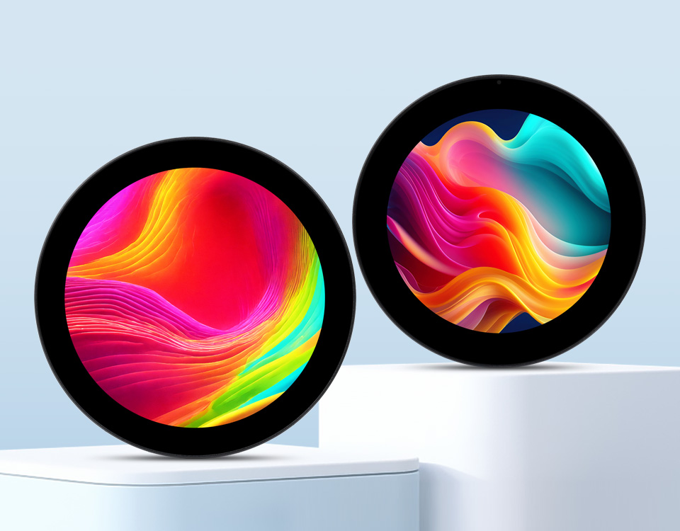

<div align="center">
  <h1>ESP32-P4-WIFI6-Touch-LCD-XC</h1>
  <p><strong>ESP32-P4 3.4 / 4-inch round IPS touch display development boards with Wi-Fi 6</strong></p>
  <p>
    <a href="https://github.com/waveshareteam/ESP32-P4-WIFI6-Touch-LCD-XC/actions/workflows/esp-idf-projects.yml"></a>
    <a href="LICENSE"></a>
  </p>
  <p>
    <a href="README_ZH.md">中文</a> ·
    <a href="https://www.waveshare.com/esp32-p4-wifi6-touch-lcd-3.4c.htm">🌐 Product Page</a> ·
    <a href="https://docs.waveshare.com/ESP32-P4-WIFI6-Touch-LCD-XC">📚 Product Documentation</a> ·
    <a href="examples/esp-idf/">🧩 ESP-IDF Examples</a> ·
    <a href="examples/arduino/">🔧 Arduino Examples</a>
  </p>
  <a href="https://www.waveshare.com/esp32-p4-wifi6-touch-lcd-3.4c.htm">
    
  </a>
</div>

---

## ✨ Overview

This repository provides board-specific ESP-IDF examples, Arduino sketches and
bundled libraries, ESP-Brookesia firmware source, hardware references, and
development documentation for the Waveshare ESP32-P4-WIFI6-Touch-LCD-XC
series.

The two variants combine an ESP32-P4 application processor with an ESP32-C6
wireless coprocessor and a round MIPI-DSI touch display. They are designed for
rich human-machine interfaces, multimedia applications, edge computing, smart
home controls, and interactive dashboards.

## 🖥️ Product Variants

| Model | SKU | Display |
| --- | ---: | --- |
| [ESP32-P4-WIFI6-Touch-LCD-3.4C](https://www.waveshare.com/esp32-p4-wifi6-touch-lcd-3.4c.htm) | 31523 | 3.4-inch round IPS LCD, 800 × 800 |
| [ESP32-P4-WIFI6-Touch-LCD-4C](https://www.waveshare.com/esp32-p4-wifi6-touch-lcd-3.4c.htm) | 31522 | 4-inch round IPS LCD, 720 × 720 |

Both variants are available from the same
[product page](https://www.waveshare.com/esp32-p4-wifi6-touch-lcd-3.4c.htm);
select the required model under **Version Options**.

## ⚙️ Hardware Overview

| Feature | Device / interface |
| --- | --- |
| Application processor | ESP32-P4NRW32 with dual-core HP RISC-V up to 360 MHz and an LP RISC-V core up to 40 MHz |
| Memory | 32 MB in-package PSRAM and 32 MB NOR Flash |
| Wireless | ESP32-C6-MINI-1 over SDIO, providing 2.4 GHz Wi-Fi 6 and Bluetooth 5 (LE) |
| Display | 2-lane MIPI-DSI round IPS LCD; 3.4-inch 800 × 800 or 4-inch 720 × 720 |
| Touch | GT9271 capacitive touch controller with up to 10-point touch |
| Camera | 2-lane MIPI-CSI camera interface |
| Audio | ES8311 audio codec, ES7210 audio ADC, onboard microphones, and an 8 Ω / 2 W speaker header |
| Storage and USB | SDIO 3.0 microSD slot and USB 2.0 OTG High-Speed |
| Expansion | 40-pin GPIO header, ESP32-C6 UART header, ESP32-P4 debug header, and RTC battery header |
| Hardware files | [Board schematic](hardware/schematics/ESP32-P4-WIFI6-Touch-LCD-XC-Schematic.pdf) |

See the
[official product documentation](https://docs.waveshare.com/ESP32-P4-WIFI6-Touch-LCD-XC)
for complete specifications, interface descriptions, dimensions, and usage
instructions.

## 🚀 Quick Start

ESP-IDF `v5.5.4` is the version used by the current CI workflow.

```bash
cd examples/esp-idf/02_HelloWorld
idf.py set-target esp32p4
idf.py build
idf.py -p PORT flash monitor
```

Replace `PORT` with the serial port connected to the board. Examples that use
Wi-Fi, media files, display options, or other board-specific settings may
require configuration through `idf.py menuconfig`.

For environment setup and more detailed instructions, see
[Getting Started](docs/GETTING_STARTED.md).

## 🧪 Examples

### ESP-IDF

| Example | Focus |
| --- | --- |
| [01_HowToCreateProject](examples/esp-idf/01_HowToCreateProject/) | Minimal ESP-IDF project structure |
| [02_HelloWorld](examples/esp-idf/02_HelloWorld/) | Basic application and board bring-up |
| [03_i2c_tools](examples/esp-idf/03_i2c_tools/) | I2C scanning and command tools |
| [04_wifistation](examples/esp-idf/04_wifistation/) | Wi-Fi station through the ESP32-C6 coprocessor |
| [05_sdmmc](examples/esp-idf/05_sdmmc/) | microSD and SDMMC access |
| [06_I2SCodec](examples/esp-idf/06_I2SCodec/) | I2S audio codec input and output |
| [07_Displaycolorbar](examples/esp-idf/07_Displaycolorbar/) | MIPI-DSI LCD color bars |
| [08_lvgl_demo_v9](examples/esp-idf/08_lvgl_demo_v9/) | LVGL 9 display and touch demo |
| [09_video_lcd_display](examples/esp-idf/09_video_lcd_display/) | Camera-to-display video pipeline |
| [10_mp4_player](examples/esp-idf/10_mp4_player/) | MP4 / AVI media playback |
| [11_esp_brookesia_phone](examples/esp-idf/11_esp_brookesia_phone/) | ESP-Brookesia phone-style UI |
| [12_usb_extend_screen](examples/esp-idf/12_usb_extend_screen/) | USB extended display |

The maintained ESP-Brookesia firmware application is under
[`firmware/brookesia`](firmware/brookesia/).

### Arduino

| Sketch | Focus |
| --- | --- |
| [HelloWorld](examples/arduino/examples/HelloWorld/) | Display bring-up |
| [AsciiTable](examples/arduino/examples/AsciiTable/) | Text and character rendering |
| [Drawing_board](examples/arduino/examples/Drawing_board/) | Capacitive-touch drawing board |
| [GFX_ESPWiFiAnalyzer](examples/arduino/examples/GFX_ESPWiFiAnalyzer/) | Wi-Fi scanning and channel visualization |
| [LVGLV9_Arduino](examples/arduino/examples/LVGLV9_Arduino/) | LVGL 9 display and touch demo |

Bundled libraries are kept under
[`examples/arduino/libraries`](examples/arduino/libraries/). Their upstream
library examples are not first-party product examples. See the
[Arduino notes](examples/arduino/README.md) for dependencies and current
platform guidance.

## ✅ Continuous Integration

| Surface | Current coverage |
| --- | --- |
| Repository self-check | Documentation and project structure |
| ESP-IDF | Changed first-party projects with ESP-IDF `v5.5.4`, target `esp32p4` |
| Arduino | Sketches are included in the repository but are not built by the current workflow |

Changes to `README.md` and files under `docs/` trigger the repository
self-check. ESP-IDF build jobs run when a first-party project changes or when
all projects are selected manually. See
[Continuous Integration](docs/CI.md) for workflow discovery and dispatch
behavior.

## 🗂️ Repository Layout

| Path | Purpose |
| --- | --- |
| [`examples/esp-idf/`](examples/esp-idf/) | First-party ESP-IDF projects |
| [`examples/arduino/`](examples/arduino/) | First-party Arduino sketches and bundled libraries |
| [`firmware/`](firmware/) | Board firmware source projects |
| [`hardware/`](hardware/) | Schematics and hardware reference files |
| [`docs/`](docs/) | Getting-started, structure, CI, and troubleshooting guides |
| [`assets/`](assets/) | Product images used by the documentation |
| [`.github/`](.github/) | GitHub Actions workflows and CI helper scripts |

## 📚 Documentation

- [Official Product Documentation](https://docs.waveshare.com/ESP32-P4-WIFI6-Touch-LCD-XC)
- [Official Chinese Product Documentation](https://docs.waveshare.net/ESP32-P4-WIFI6-Touch-LCD-XC/)
- [Getting Started](docs/GETTING_STARTED.md)
- [Examples Guide](examples/README.md)
- [Project Structure](docs/PROJECT_STRUCTURE.md)
- [Continuous Integration](docs/CI.md)
- [Troubleshooting](docs/TROUBLESHOOTING.md)
- [Board Schematic](hardware/schematics/ESP32-P4-WIFI6-Touch-LCD-XC-Schematic.pdf)

## 🤝 Support and Contributions

Contributions and reproducible issue reports are welcome. Include the product
variant and hardware revision, example path, framework version, reproduction
steps, expected behavior, actual behavior, and relevant serial logs.

- [Open an Issue](https://github.com/waveshareteam/ESP32-P4-WIFI6-Touch-LCD-XC/issues)
- [Official Product Documentation](https://docs.waveshare.com/ESP32-P4-WIFI6-Touch-LCD-XC)
- For order-related technical support, contact the Waveshare team and include
  the order number.

## 📄 License

This repository is licensed under the Apache License 2.0. See
[LICENSE](LICENSE).
